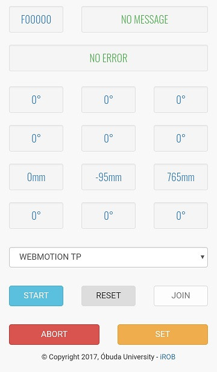

# fanuc-webcontrol

## Overview
Simple software to control Fanuc robots through browser.

**NOTE**: It is an experimental software. Do not use this in production systems!

THE SOFTWARE IS DISTRIBUTED IN THE HOPE THAT IT WILL BE USEFUL, BUT WITHOUT ANY WARRANTY. IT IS PROVIDED "AS IS" WITHOUT WARRANTY OF ANY KIND, EITHER EXPRESSED OR IMPLIED, INCLUDING, BUT NOT LIMITED TO, THE IMPLIED WARRANTIES OF MERCHANTABILITY AND FITNESS FOR A PARTICULAR PURPOSE. THE ENTIRE RISK AS TO THE QUALITY AND PERFORMANCE OF THE SOFTWARE IS WITH YOU. SHOULD THE SOFTWARE PROVE DEFECTIVE, YOU ASSUME THE COST OF ALL NECESSARY SERVICING, REPAIR OR CORRECTION.

## TOC
1. [Requirements](#requirements)
2. [Installation](#installation)
3. [Configuration](#configuration)
4. [Example usage](#example-usage)
5. [Notes](#notes)
6. [Acknowledgement](#acknowledgement)
7. [Bugs, feature requests, etc](#bugs-feature-requests-etc)

## Requirements
This is written in Fanuc Karel language and TP code. It is tested on FANUC M-430iA2P robot with R-J3iC controller v7.40

The following registers [R], position registers[PR] and FLAGs are used:
- [R]: 40, 41, 42,
- [PR]: 40, 41,
- FLAG: 1, 2, 3, 4, 5, 6,

If these (position) registers and/or flags are not free, than you can choose anothers, but you have to update these numbers in the karel programs and the `webmotion.tp` file.

Internet connection is also required because the Bootstrap, PEP and JQuery libraries are loaded from CDNs.

## Installation
1. Copy the `*.pc` and files from the `karel` folder to the robot `MD:` folder
2. Copy the `webpanel.htm` file from the `examples` folder to the robot `MD:` folder
3. Copy the `webmotion.tp` file from the `tpe` folder to the robot `MD:` folder

## Configuration
Set UNLOCK to HTTP authentication of KAREL: 
1. On the Teach Pendant select `Menu -> Setup -> Host Comm`
2. Set the cursor on `HTTP`
3. Push `F3[DETAIL]`
4. Set the cursor on `A` left side of KAREL. Select `F3[UNLOCK]`

## Example usage
Run the WEBMOTION tp program on the controller
Open a browser and type: http://robotIP/md/webpanel.htm
- JOG page: jogging the robot (Push and hold down a button, but only use just one at the same time!)
- POSE: move the TCP to a predefined position (Click on a button, and wait until the robot completes the movement.)
- CART: move the TCP +/-xyz direction and/or rotate it in the UFRAME (Push and hold down a button, but only use just one at the same time!)

## Notes
1. You can change the steps (defaults: 1 degree, 3 mm) and the predefined positions in the javascript part of the `webpanel.htm`.
2. After push ABORT buttons, you have to reset the controller and abort all running task (`Fctn -> 1 ABORT (ALL)`), AND jump back to the first line of the `WEBMOTION` TP program.
3. If you push very offen (e.g. twice in a second) a button on the `webpanel.htm` then your browser can be crashed and need to be reload or re-open it.
4. If the Z limit is reached the robot motion is locked. Press a POSE key to unlock it.

## Acknowledgement
We acknowledge the financial support of this work by the Hungarian State and the European Union under the  EFOP-3.6.1-16-2016-00010 project.

## Bugs, feature requests, etc
Please use the [GitHub issue tracker][].

[GitHub issue tracker]: https://github.com/ABC-iRobotics/fanuc-webcontrol/issues